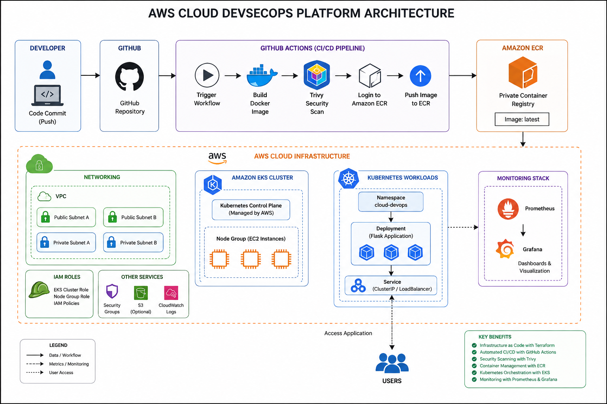
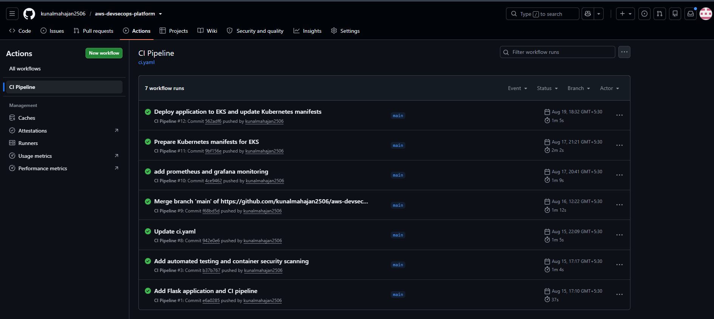
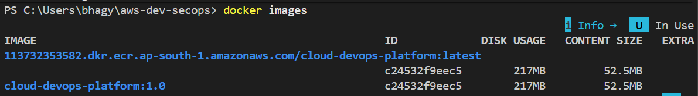
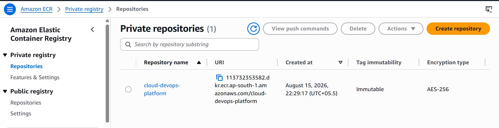
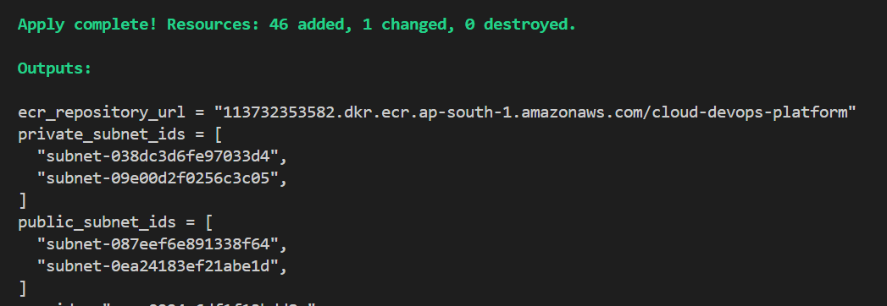
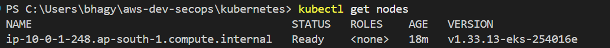
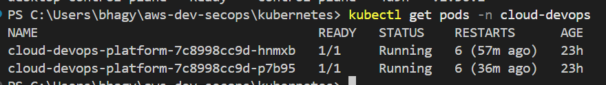
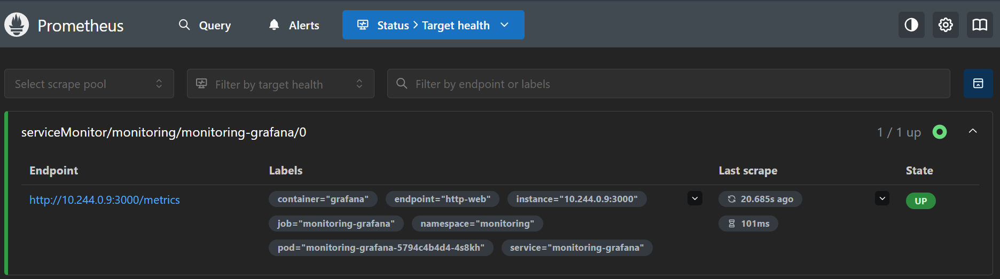
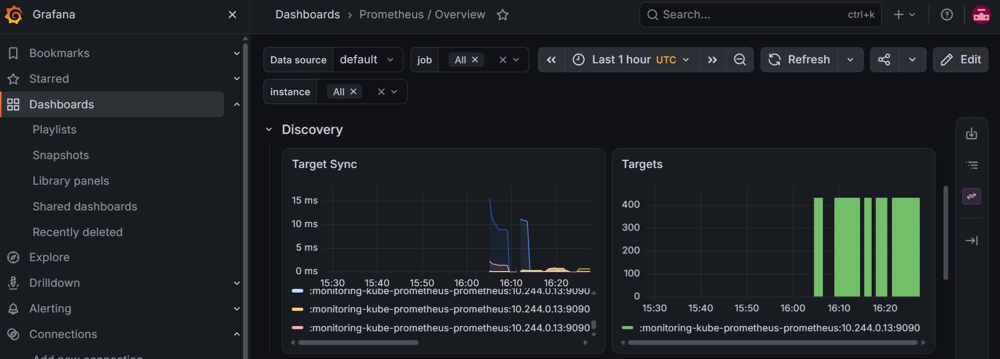

# 🚀 AWS Cloud DevSecOps Platform

An end-to-end Cloud & DevSecOps project demonstrating infrastructure provisioning, containerization, CI/CD automation, container security scanning, Kubernetes deployment, and application monitoring on AWS.

## 📌 Project Overview

The **AWS Cloud DevSecOps Platform** is a production-style cloud-native deployment project built using AWS, Terraform, Docker, Kubernetes, GitHub Actions, Trivy, Amazon ECR, Prometheus, and Grafana.

The project implements the application delivery lifecycle:

```text
Developer
   │
   ▼
GitHub
   │
   ▼
GitHub Actions
   │
   ├── Build
   ├── Docker Image
   ├── Trivy Security Scan
   └── Push Image
          │
          ▼
     Amazon ECR
          │
          ▼
      Amazon EKS
          │
          ▼
     Kubernetes
          │
          ├── Flask Pods
          ├── Service
          └── Health Checks
          │
          ▼
     Prometheus
          │
          ▼
       Grafana
```

Terraform is used to provision and manage the AWS infrastructure.

---

## 🎯 Objectives

- Provision AWS infrastructure using Terraform
- Build and containerize a Python Flask application
- Automate CI/CD using GitHub Actions
- Scan Docker images using Trivy
- Store container images in Amazon ECR
- Deploy the application to Kubernetes on Amazon EKS
- Implement health and readiness checks
- Expose application metrics through `/metrics`
- Monitor application and Kubernetes metrics using Prometheus and Grafana
- Practice DevSecOps, Infrastructure as Code, and cloud cost management

---

## 🏗️ Architecture



### Workflow

```text
GitHub
   ↓
GitHub Actions
   ↓
Docker Build
   ↓
Trivy Scan
   ↓
Amazon ECR
   ↓
Amazon EKS
   ↓
Kubernetes Service
   ↓
Flask Application
   ↓
Prometheus
   ↓
Grafana
```

Terraform manages the underlying AWS infrastructure.

---

## 🛠️ Technology Stack

| Technology | Purpose |
|---|---|
| AWS | Cloud infrastructure |
| Terraform | Infrastructure as Code |
| Python / Flask | Application |
| Docker | Containerization |
| Amazon ECR | Container image registry |
| Amazon EKS | Managed Kubernetes |
| Kubernetes | Application orchestration |
| GitHub Actions | CI/CD automation |
| Trivy | Container vulnerability scanning |
| Prometheus | Metrics collection |
| Grafana | Monitoring and visualization |
| AWS CLI | AWS management |
| kubectl | Kubernetes management |
| Helm | Kubernetes package management |
| Git / GitHub | Version control |

---

## 📁 Project Structure

```text
aws-devsecops-platform/
│
├── app/
│   ├── app.py
│   ├── requirements.txt
│   └── ...
│
├── kubernetes/
│   ├── namespace.yaml
│   ├── deployment.yaml
│   ├── service.yaml
│   └── servicemonitor.yaml
│
├── terraform/
│   ├── main.tf
│   ├── variables.tf
│   ├── outputs.tf
│   ├── versions.tf
│   └── terraform.lock.hcl
│
├── .github/
│   └── workflows/
│       └── ...
│
├── docs/
│   ├── architecture.png
│   └── PROJECT_REPORT.pdf
│
├── screenshots/
│   ├── github-actions.png
│   ├── terraform-apply.png
│   ├── ecr.png
│   ├── eks-nodes.png
│   ├── kubernetes-pods.png
│   ├── kubernetes-service.png
│   ├── prometheus.png
│   └── grafana.png
│
├── Dockerfile
├── .dockerignore
├── .gitignore
└── README.md
```

> Update the structure if your final repository uses different filenames.

---

# 🐍 Application

The application is a lightweight Python Flask service designed to demonstrate containerization, Kubernetes deployment, health checks, readiness checks, and Prometheus monitoring.

## Endpoints

### `/`

Returns:

```text
Cloud DevOps Platform Running
```

### `/health`

Returns:

```json
{
  "status": "healthy"
}
```

This endpoint is used for application health checking.

### `/ready`

Returns:

```json
{
  "status": "ready"
}
```

This endpoint is used to determine whether the application is ready to receive traffic.

### `/metrics`

Exposes Prometheus-compatible application metrics.

---

# 🐳 Docker

The application is packaged into a Docker container.

## Build

```bash
docker build -t cloud-devops-platform .
```

## Run locally

```bash
docker run -p 5000:5000 cloud-devops-platform
```

Test:

```text
http://localhost:5000
http://localhost:5000/health
http://localhost:5000/ready
http://localhost:5000/metrics
```

---

# 🏗️ Terraform Infrastructure

Terraform is used to provision and manage AWS infrastructure.

The infrastructure includes components such as:

- VPC
- Subnets
- IAM roles and policies
- Amazon ECR
- Amazon EKS
- EKS managed node group
- Security groups
- CloudWatch logging
- Supporting AWS networking resources

## Terraform workflow

```bash
terraform init
terraform validate
terraform plan
terraform apply
```

To clean up temporary infrastructure:

```bash
terraform destroy
```

Terraform provides:

- Repeatable infrastructure
- Version-controlled configuration
- Automated provisioning
- Consistent environments
- Easier cleanup

---

# 🔐 CI/CD Pipeline

GitHub Actions automates the container build and publishing process.

```text
Git Push
   ↓
GitHub Actions
   ↓
Build Docker Image
   ↓
Trivy Security Scan
   ↓
Authenticate with AWS
   ↓
Login to Amazon ECR
   ↓
Push Docker Image
```

This reduces manual deployment steps and introduces security checks into the delivery pipeline.

---

# 🔒 Trivy Security Scanning

Trivy is used to scan Docker images for known vulnerabilities.

Example:

```bash
trivy image cloud-devops-platform:latest
```

The scan can identify vulnerabilities in:

- Operating system packages
- Application dependencies
- Container images
- Known CVEs

Security scanning is performed as part of the CI/CD workflow.

---

# 📦 Amazon ECR

Amazon Elastic Container Registry stores the Docker image used by Kubernetes.

Example image format:

```text
<account-id>.dkr.ecr.ap-south-1.amazonaws.com/cloud-devops-platform:<tag>
```

The workflow is:

```text
Docker Build
    ↓
Trivy Scan
    ↓
ECR Push
    ↓
EKS Pull
```

---

# ☸️ Kubernetes / Amazon EKS

The application is deployed to Kubernetes using declarative YAML manifests.

The Kubernetes configuration includes:

- Namespace
- Deployment
- Pods
- Service
- Health probes
- Readiness probes
- Resource configuration
- Monitoring configuration

## Configure EKS access

```bash
aws eks update-kubeconfig \
  --region ap-south-1 \
  --name cloud-devops-platform
```

## Verify nodes

```bash
kubectl get nodes
```

## Deploy manifests

```bash
kubectl apply -f kubernetes/
```

## Verify Pods

```bash
kubectl get pods -n cloud-devops
```

## Verify Services

```bash
kubectl get svc -n cloud-devops
```

## Verify Deployments

```bash
kubectl get deployments -n cloud-devops
```

---

# 🩺 Health and Readiness Checks

Kubernetes uses the application's health endpoints to determine workload status.

```text
/health
    ↓
Liveness / Health Check

/ready
    ↓
Readiness Check
```

This helps Kubernetes detect unhealthy containers and prevent traffic from being sent to containers that are not ready.

---

# 📊 Monitoring

Prometheus and Grafana provide application and Kubernetes observability.

```text
Flask Application
       │
       │ /metrics
       ▼
   Prometheus
       │
       ▼
    Grafana
```

## Prometheus

Prometheus collects metrics exposed by the application and Kubernetes environment.

## Grafana

Grafana visualizes metrics through dashboards.

Example port forwarding:

```bash
kubectl port-forward \
  svc/monitoring-grafana \
  3000:80 \
  -n monitoring
```

Then open:

```text
http://localhost:3000
```

Prometheus can be port-forwarded similarly according to the installed monitoring stack.

---

# 🔭 ServiceMonitor

A Kubernetes `ServiceMonitor` can be used with the Prometheus Operator to discover the application's metrics endpoint.

```text
Flask
  ↓
/metrics
  ↓
Kubernetes Service
  ↓
ServiceMonitor
  ↓
Prometheus
  ↓
Grafana
```

---
## 📸 Project Evidence

### CI/CD Pipeline



### Docker Image



### Amazon ECR



### Terraform Infrastructure



### Amazon EKS



### Kubernetes Deployment



### Prometheus Monitoring



### Grafana Dashboard



# 🔐 Security Practices

The project follows several security practices:

- AWS credentials are not stored in the repository
- IAM is used for AWS access
- Docker images are scanned using Trivy
- Terraform generated provider binaries are excluded from Git
- Terraform state files are excluded from Git
- Container images are stored in Amazon ECR
- Kubernetes health checks are implemented
- Infrastructure is managed through Terraform

Recommended `.gitignore` entries include:

```gitignore
.terraform/
*.tfstate
*.tfstate.*
```

The `.terraform.lock.hcl` file is retained to help maintain reproducible provider versions.

---

# 🧪 Local Kubernetes Testing

The Kubernetes manifests can be tested locally using Minikube before deployment to EKS.

```bash
minikube start
kubectl get nodes
kubectl apply -f kubernetes/
kubectl get pods -n cloud-devops
kubectl get svc -n cloud-devops
```

This provides a local validation stage before using AWS infrastructure.

---

# ✅ Verification Checklist

### Application

- [x] Flask application implemented
- [x] `/` endpoint
- [x] `/health` endpoint
- [x] `/ready` endpoint
- [x] `/metrics` endpoint

### Docker

- [x] Dockerfile created
- [x] Docker image built
- [x] Container tested locally

### CI/CD

- [x] GitHub Actions configured
- [x] Docker build automated
- [x] Trivy scanning integrated
- [x] ECR authentication configured
- [x] Docker image pushed to ECR

### Infrastructure

- [x] Terraform configuration
- [x] AWS networking
- [x] IAM configuration
- [x] ECR
- [x] EKS
- [x] EKS worker nodes

### Kubernetes

- [x] Namespace
- [x] Deployment
- [x] Service
- [x] Health checks
- [x] Readiness checks
- [x] EKS deployment

### Monitoring

- [x] Prometheus
- [x] Grafana
- [x] Application metrics
- [x] ServiceMonitor configuration

> Only keep a checkbox marked `[x]` if you actually implemented and verified that component.

---

# 🧠 Key DevOps Concepts Demonstrated

## Cloud

- AWS VPC
- Subnets
- IAM
- ECR
- EKS
- EC2
- CloudWatch
- Load balancing concepts

## DevOps

- CI/CD
- Infrastructure as Code
- Docker
- Kubernetes
- Git
- Automated deployment

## DevSecOps

- Container vulnerability scanning
- Security checks in CI/CD
- IAM-based access
- Secure credential management

## Observability

- Prometheus
- Grafana
- Application metrics
- Kubernetes metrics
- Health checks
- Readiness checks

---

# 🧩 Challenges & Solutions

## GitHub 100 MB File Limit

Terraform's generated `.terraform` directory accidentally contained a large AWS provider binary.

GitHub rejected the push because the provider binary exceeded the 100 MB file-size limit.

### Solution

Generated Terraform files were excluded using:

```gitignore
.terraform/
```

The provider binary was removed from Git tracking while the dependency lock file was retained.

---

## ECR Repository Cleanup

An ECR repository containing Docker images cannot normally be deleted without deleting the images first.

Terraform therefore reported:

```text
RepositoryNotEmptyException
```

The project retained the ECR repository and image for future development.

---

## AWS Resource Cleanup

After testing, temporary AWS infrastructure was destroyed using:

```bash
terraform destroy
```

This helps prevent unnecessary ongoing charges from resources such as EKS, worker nodes, NAT gateways, and load balancers.

---

# 💰 Cost Management

This project was designed as a development and learning environment.

AWS resources should only be kept running when required.

Resources that can contribute significantly to costs include:

- EKS
- EC2 worker nodes
- NAT Gateways
- Load Balancers
- EBS volumes
- CloudWatch logs
- ECR storage

After testing, Terraform can be used to remove temporary infrastructure:

```bash
terraform destroy
```

The ECR repository can be retained if the Docker image is needed for future development.

Always review the Terraform plan/destroy output before confirming infrastructure changes.

---

# 🔮 Future Improvements

The following features can be added in future iterations:

- Argo CD GitOps deployment
- AWS Load Balancer Controller
- HTTPS using AWS Certificate Manager
- Route 53 custom domain
- Horizontal Pod Autoscaler
- Alertmanager notifications
- Centralized logging
- AWS Secrets Manager
- Kubernetes Network Policies
- Blue/Green deployments
- Canary deployments
- Terraform remote state using S3
- Multi-environment infrastructure
- Automated image tag updates

---

# 📈 Project Outcome

This project demonstrates an end-to-end Cloud DevSecOps workflow:

```text
Source Code
    ↓
GitHub
    ↓
CI/CD
    ↓
Docker
    ↓
Security Scan
    ↓
Amazon ECR
    ↓
Amazon EKS
    ↓
Kubernetes
    ↓
Prometheus
    ↓
Grafana
```

The project provided practical experience in:

- AWS infrastructure design
- Terraform
- Docker
- Kubernetes
- Amazon EKS
- Amazon ECR
- GitHub Actions
- Trivy
- Prometheus
- Grafana
- DevSecOps
- Cloud cost management
- Troubleshooting cloud infrastructure

---

# 👨‍💻 Author

## Girish Mahajan

Final-Year Information Technology Engineering Student

### Areas of Interest

- AWS Cloud
- Cloud Engineering
- DevOps
- DevSecOps
- Kubernetes
- Infrastructure as Code
- Cloud Architecture

---

# 📄 Detailed Project Report

A detailed technical project report is available here:

**[View Project Report](docs/PROJECT_REPORT.pdf)**

---

# ⭐ Conclusion

The AWS Cloud DevSecOps Platform demonstrates how modern cloud-native applications can be provisioned, secured, containerized, deployed, and monitored using a combination of AWS, Terraform, Docker, Kubernetes, GitHub Actions, Trivy, Prometheus, and Grafana.

The project focuses on practical implementation rather than individual tool usage, providing an end-to-end demonstration of a modern Cloud and DevSecOps workflow.

---

## 📌 Disclaimer

This project was developed for educational, portfolio, and hands-on Cloud/DevOps learning purposes.

AWS resources should be monitored and destroyed when no longer required to avoid unnecessary cloud charges.
